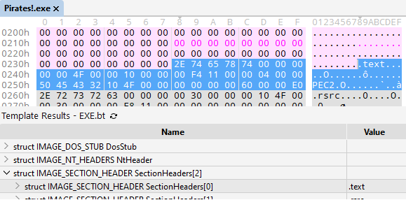
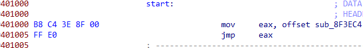
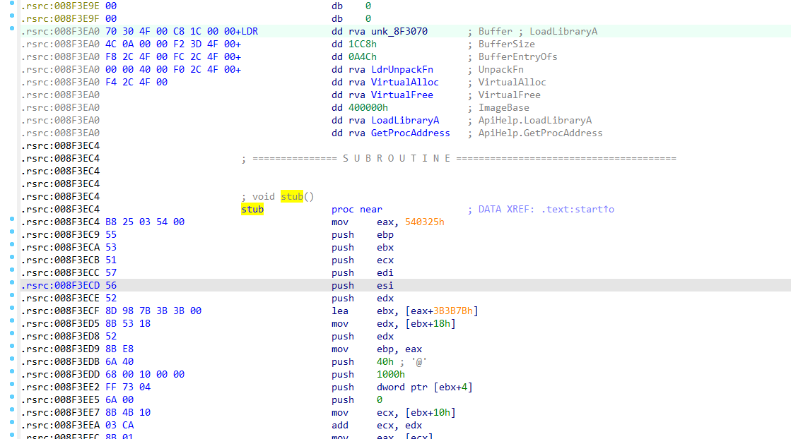
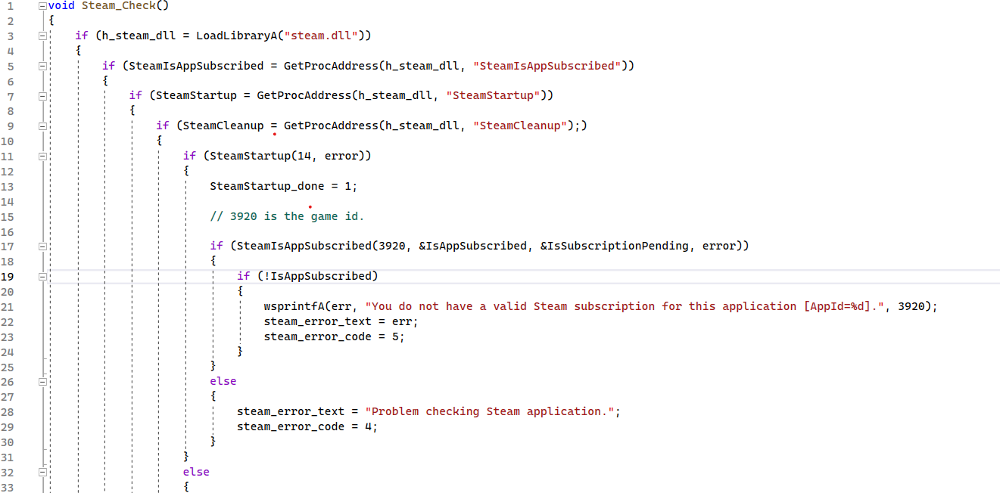
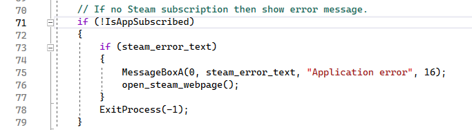

Pirates! is the game by **Sid Meier** I loved to play a lot.
It is colourful and entertaining and is really good for 2004.
Interestingly that main executable on Steam is protected with **PECompact**.
So this is the small overview.

**Sid Meier’s Pirates (2004) on Steam**

The game is packed with PECompact 2. You can see the first section “.text” has a PEC2signature at the PointerToRelocations field.

Entry point has 7 bytes to jump to the last section in the file to execute the loader.

The code looks like this

See, there is structure before the code block, describing some values. We are interested in Buffer,BufferSize, BufferEntryOfsand LdrUnpackFn. This unpack function will APLib-decompress buffer to allocated memory. Unpacked buffer will process the image and return the real entry point.

Let’s see what’s inside of the unpacked buffer. The size is 0x1CC8 bytes.

Code will be executed at BufferEntryOfs offset of the decompressed buffer.

It will recover 7 bytes at start (if needed), unpack and process memory regions (copy, decrypt, update JMP, CALL opcodes).

Then the import directory is processed and all needed DLLs are loaded and imported functions are resolved. Address of the real import directory is set in image headers.

Raw address of the last section is updated in image headers (if it was invalid).

Now the executable image in memory is ready.

Before exit, one Steam check function is called. It will check if there is a Steam Subscription for the game.

And will exit the process if none (showing message and opening Steam page in browser).

Then the original entry point is returned to the caller function and execution transferred to the original entry. So the game starts.